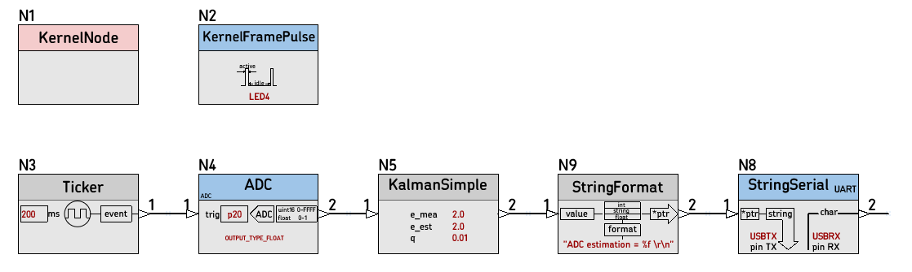
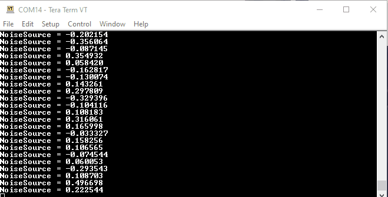
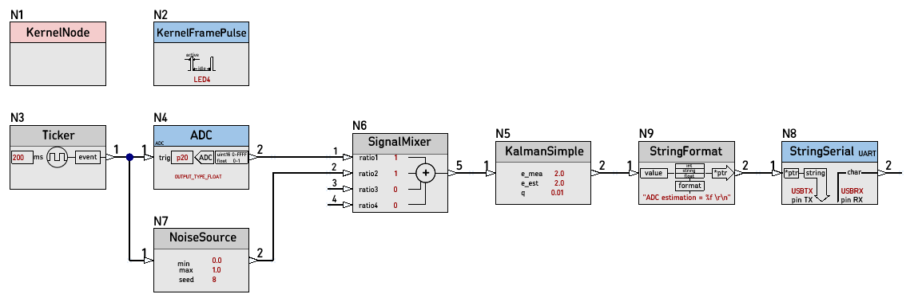
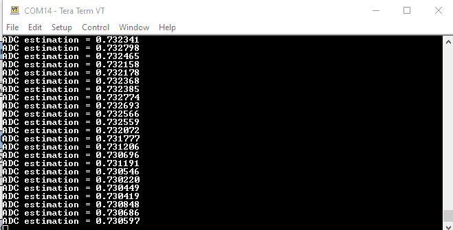
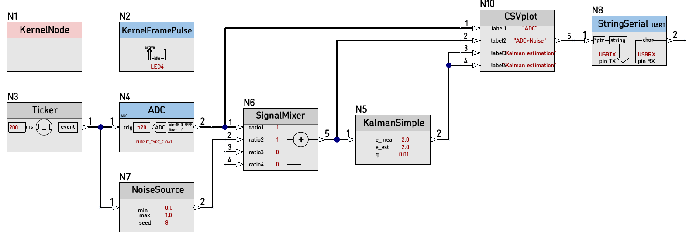

# [42D_KalmanSimple_test_FIRMWARE](https://github.com/nBlocksStudioApps/42D_KalmanSimple_test_FIRMWARE)

A schematic Design for Testing the Node [KalmanSimple](https://github.com/nBlocksStudioNodes/nblocks_kalmansimple) and [42D_KalmanSimple_test_SCH](https://github.com/nBlocksStudioApps/42D_KalmanSimple_test_SCH)

## 1. KalmanSimple Node testing

## 2. NoiseSource Node testing

----

## 3. SignalMixer Node testing

----

----

## 4. CSVplot Node testing

----

----
